# 实验1 配置无人值守安装iso并在Virtualbox中完成自动化安装

## 实验问题：
1. 如何配置无人值守安装iso并在Virtualbox中完成自动化安装。
2. Virtualbox安装完Ubuntu之后新添加的网卡如何实现系统开机自动启用和自动获取IP？
3. 如何使用sftp在虚拟机和宿主机之间传输文件？

## 实验环境：
- 镜像：ubuntu-18.04.1-server-amd64
- 虚拟主机配置双网卡，其中配置host-only网卡时，需要启用dhcp服务器才能分配到ip地址，以便putty连接

## 实验目标：
1. 定制一个普通用户名和默认密码
2. 定制安装OpenSSH Server
3. 安装过程禁止自动联网更新软件包

## 一、配置无人值守安装iso并在Virtualbox中完成自动化安装。
- 配置双网卡：
	- NAT
	- host-only
- 配置host-only网卡
	- `sudo vim /etc/netplan/01-netcfg.yaml` 打开配置文件，增加新网卡
	- `sudo netplan apply` 使修改生效
	- `ifconfig` 查看正确的网卡信息

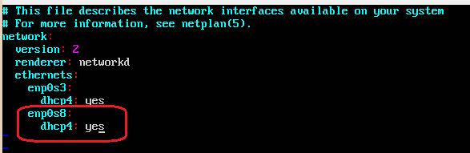

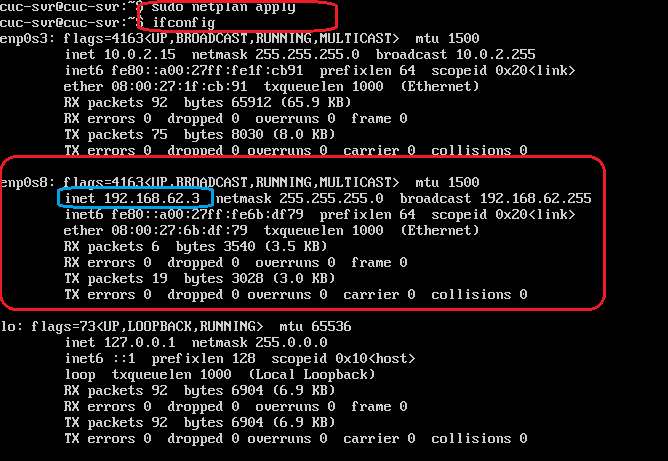

- 安装 openssh-server 并确认ssh正常工作

```bash

	# 更新源
	sudo apt update
		
	# 安装 OpenSSH 服务器应用
	sudo apt install openssh-server
		
	# 启用ssh
	sudo /etc/init.d/ssh start

	# 确认ssh服务处于开启状态
	server ssh status
```

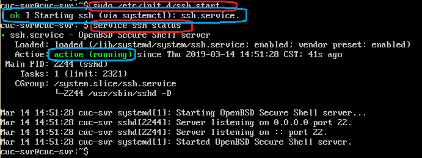

- 使用putty配置ssh
	- 使用putty连接虚拟机

	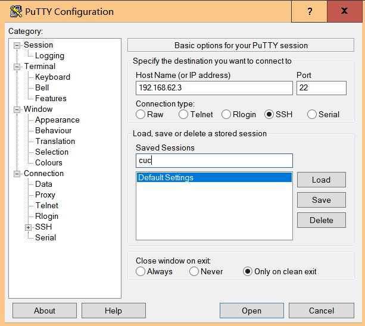

	- 使用psftp将下载好的镜像传入虚拟机

	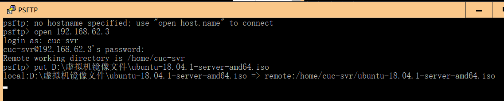

	- 创建定制版无人值守iso镜像文件

```bash
	# 在当前用户目录下创建一个用于挂载iso镜像文件的目录
	mkdir loopdir
			
	# 挂载iso镜像文件到该目录
	# -o loop 用来把一个文件当成硬盘分区挂接上系统
	# loopdir 挂载点

	# 挂载iso镜像文件到该目录
	sudo mount -o loop ubuntu-16.04.1-server-amd64.iso loopdir
			
	# 创建一个工作目录用于克隆光盘内容
	mkdir cd
			
	# 同步光盘内容到目标工作目录
	# 一定要注意loopdir后的这个/，cd后面不能有/
	rsync -av loopdir/ cd
			
	# 卸载iso镜像
	sudo umount loopdir
			
	# 进入目标工作目录，之后在虚拟机里的操作都在该目录下进行
	cd cd/
			
	# 编辑Ubuntu安装引导界面增加一个新菜单项入口
	sudo vim isolinux/txt.cfg
	# 在txt.cfg中添加以下内容并强制保存
	label autoinstall
		 menu label ^Auto Install Ubuntu Server
			     kernel /install/vmlinuz
			  append  file=/cdrom/preseed/ubuntu-server-autoinstall.seed debian-installer/locale=en_US console-setup/layoutcode=us keyboard-configuration/layoutcode=us console-setup/ask_detect=false localechooser/translation/warn-light=true localechooser/translation/warn-severe=true initrd=/install/initrd.gz 
			  
```

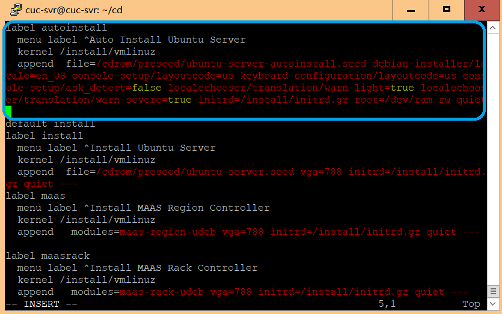

```bash

	# 修改配置缩短超时等待时间
	# timeout 10
	sudo vi isolinux/isolinux.cfg
```

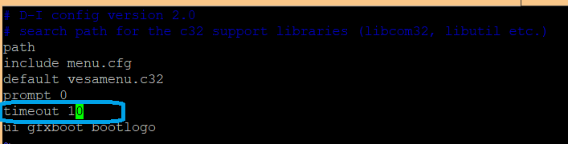

- 下载已经定制好的ubuntu-server-autoinstall.seed

```bash

	# 移动到指定目录下
	sudo mv ubuntu-server-autoinstall.seed ~/cd/preseed/
			
	# 重新生成md5sum.txt
	find . -type f -print0 | xargs -0 md5sum > /tmp/md5sum.txt

	sudo mv /tmp/md5sum.txt md5sum.txt
```

- 生成MD5文件需要修改文件权限或提升至管理员权限（用root -s提权即可）
		
	- 打开shell脚本，添加内容保存退出，然后执行shell

```bash
	# 打开脚本呢
	sudo vim shell
			
	# 添加以下内容
	# 封闭改动后的目录到.iso
	IMAGE=custom.iso
	BUILD=~/cd/
			
	mkisofs -r -V "Custom Ubuntu Install CD" \
	           -cache-inodes \
	           -J -l -b isolinux/isolinux.bin \
	           -c isolinux/boot.cat -no-emul-boot \
			           -boot-load-size 4 -boot-info-table \
			           -o $IMAGE $BUILD
	sudo bash shell
```

- 注意执行shell脚本时会提醒没有mkisoft命令，要先下载genisoimage
		
	- 镜像制作完成

	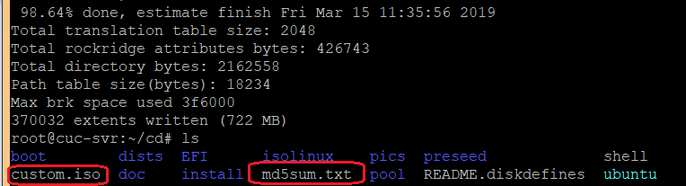

	- 将镜像使用psftp传至宿主机

	

	- 在VirtualBox上完成自动安装

	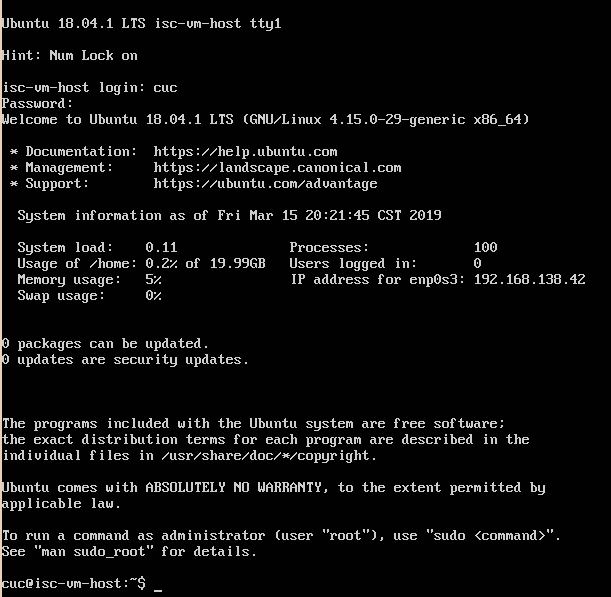

	- 安装成功的录制视频（加倍速）

	[https://v.youku.com/v_show/id_XNDA5ODIyNDkxNg==.html?spm=a2h3j.8428770.3416059.1](https://v.youku.com/v_show/id_XNDA5ODIyNDkxNg==.html?spm=a2h3j.8428770.3416059.1)

- 实现putty免密的登陆
	- 用PUTTYGEN.EXE，生成公私钥。

	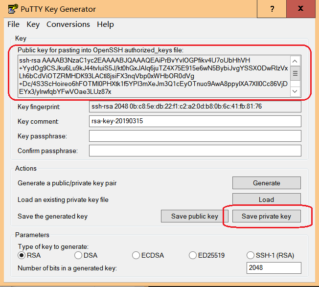

	- 存储私钥至本地，复制公钥
	- 进入虚拟机，在根目录下创建.ssh文件夹，将刚刚生成的公钥写入该文件夹下的authorized_keys中

```bash
	# 创建目录
	mkdir .ssh
	cd .ssh

	# 将刚才复制的公钥写入authorized_keys文件
	echo 'public key' > authorized_keys
```
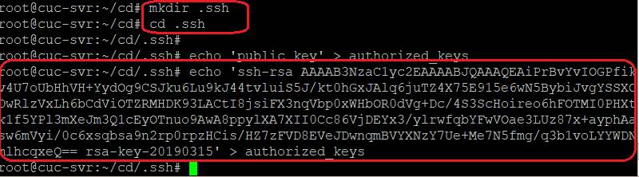

	- 打开PUTTYGEN.EXE,输入自动登录的用户名-->加载刚刚生成的私钥文件-->输入虚拟机的IP地址，将此连接存储，下次可直接免密登陆-->成功免密登陆

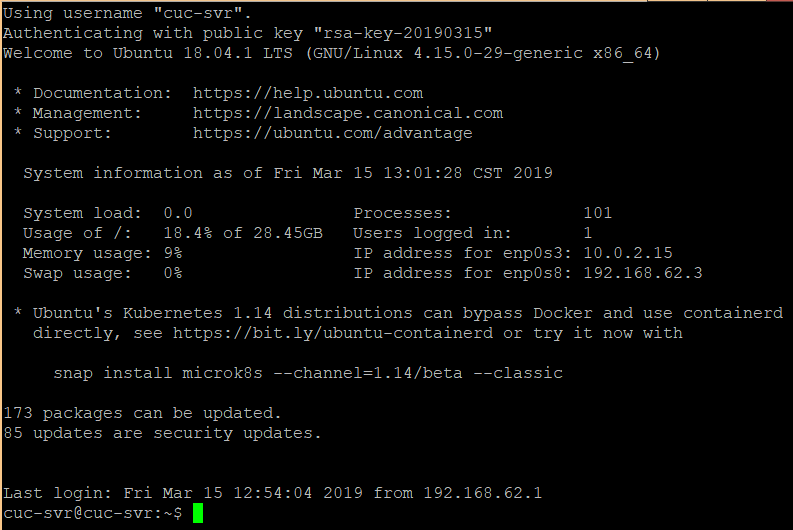


## 二、如何使用sftp在虚拟机和宿主机之间传输文件？
1. 使用psftp传输文件  

- 连接宿主机：open [宿主机IP]
- 上传：put [文件名]
- 下载：get [文件名]
	- 注意：不指定目录的情况下，上传到虚拟机根目录，下载到putty根目录
	- 注意：将psftp用管理员权限打开
2. 安装virtualbox增强功能使用共享文件夹  


## 三、定制好的ubuntu-server-autoinstall.seed与官方示例文件对比

- 左侧为修改后文件

1. 添加多种支持本地支持语言（en，zh），跳过安装时语言支持的设置


2. 设置链路等待超时和DHCP超时为5s，选择手动配置网络

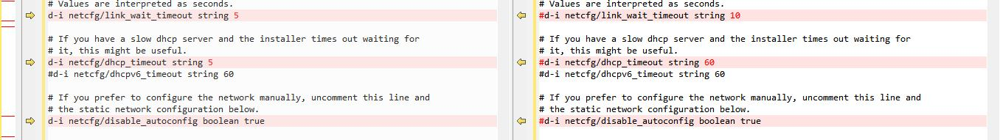

3. 网络配置


4. 配置域名和主机名


5. 定制一个普通用户名和默认密码


6. 设置时区，安装期间不实用NTP设置时钟

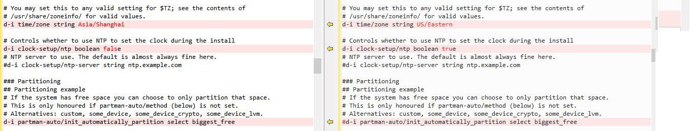

7. LVM分区中逻辑卷设置为最大。分成/home，/var和/tmp三个分区（multi）

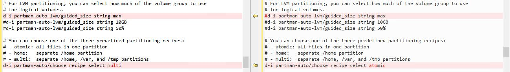

8. 安装时不实用网络镜像


9. 定制安装OpenSSH Server，不自动升级；将软件升级模式设置为automatically（自动）

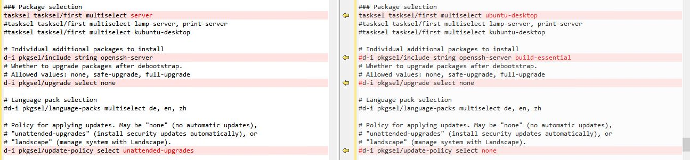

## 参考资料：
[http://blog.csdn.net/yaolong336/article/details/78030500](http://blog.csdn.net/yaolong336/article/details/78030500)

[https://github.com/CUCCS/linux-2019-FLYFLY-H/blob/linux_exp1/exp_1.md](https://github.com/CUCCS/linux-2019-FLYFLY-H/blob/linux_exp1/exp_1.md)


[https://github.com/CUCCS/linux-2019-cloud0606/blob/lab1/lab1/实验报告.md](https://github.com/CUCCS/linux-2019-cloud0606/blob/lab1/lab1/实验报告.md)


[http://blog.seclee.com/2018/05/21/ubuntu18xia-vboxpei-zhi-xu-ni-ji-shuang-wang-qia/](http://blog.seclee.com/2018/05/21/ubuntu18xia-vboxpei-zhi-xu-ni-ji-shuang-wang-qia/)