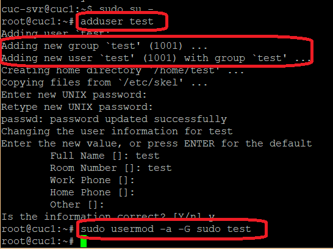
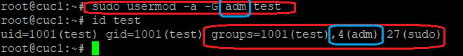
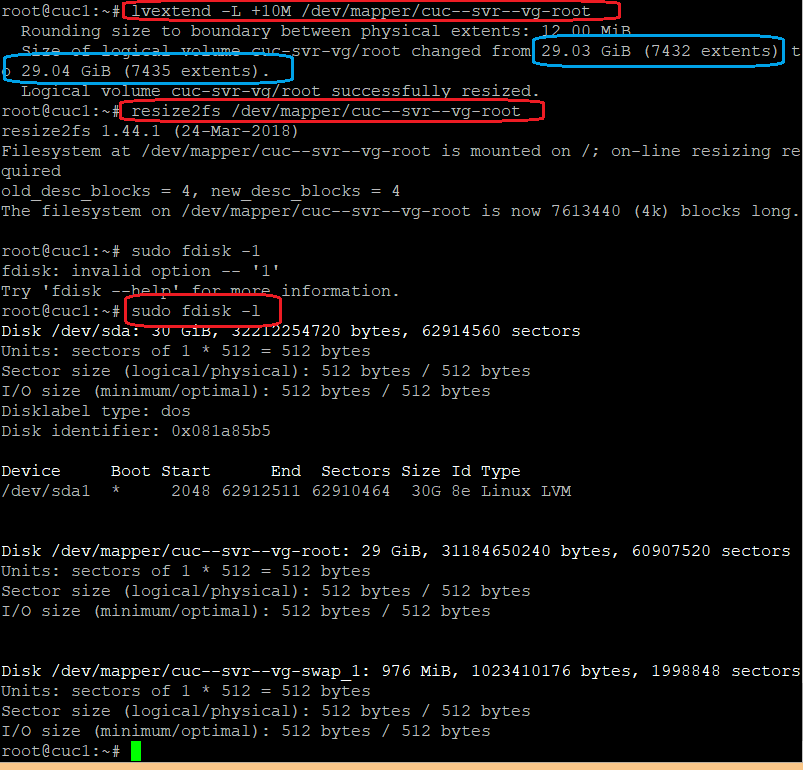
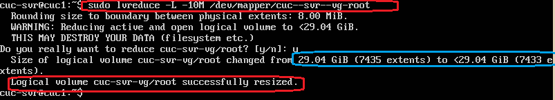
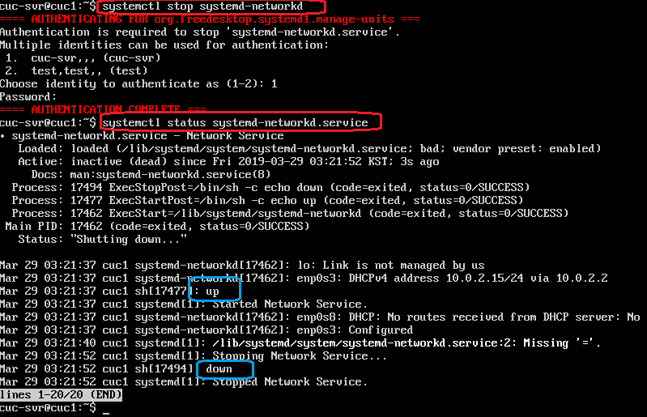
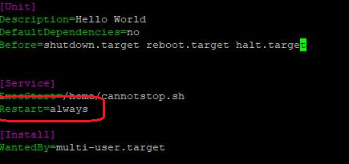
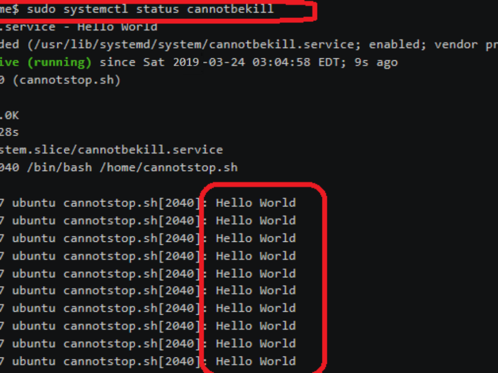

# Sytemd入门实验
## 实验内容
- [Systemd 入门教程：命令篇 by 阮一峰的网络日志](http://www.ruanyifeng.com/blog/2016/03/systemd-tutorial-commands.html)
- [Systemd 入门教程：实战篇 by 阮一峰的网络日志](http://www.ruanyifeng.com/blog/2016/03/systemd-tutorial-part-two.html) 

## 实验过程

### 命令篇录屏

- part1 系统管理 [https://asciinema.org/a/r4gnE9CeGB8JDZY9I4YzTYF5M](https://asciinema.org/a/r4gnE9CeGB8JDZY9I4YzTYF5M)
- part2 Unit  [https://asciinema.org/a/MktbcPHESeuIDfbLkKBt9hvTi](https://asciinema.org/a/MktbcPHESeuIDfbLkKBt9hvTi)
- part3 Unit配置文件   [https://asciinema.org/a/x6LMKZhtoFuN9juYwpvYNX9jB](https://asciinema.org/a/x6LMKZhtoFuN9juYwpvYNX9jB)
- part4 Target  [https://asciinema.org/a/GIS9gFrZv5btp1N1ykSFOaDkK](https://asciinema.org/a/GIS9gFrZv5btp1N1ykSFOaDkK)
- part5 日志管理  [ https://asciinema.org/a/j09KwdOHRautXHkI4qNeuVDIV]( https://asciinema.org/a/j09KwdOHRautXHkI4qNeuVDIV)


## 自查清单
### 如何添加一个用户并使其具备sudo执行程序的权限？
```bash
adduser username 
#添加用户
sudo usermod -a -G sudo username
# 将用户添加到sudo组
```



### 如何将一个用户添加到一个用户组？
```bash
sudo usermod -a -G groupname username
```


### 如何查看当前系统的分区表和文件系统详细信息？

- 查看分区表 `fdisk -l  `

- 查看文件系统详情 `# `或 `df -T -h`

### 如何实现开机自动挂载Virtualbox的共享目录分区？

```bash
- /etc/fstab 文件添加 `sharing /mnt/share vboxsf defaults 0 0`
- 或者在/etc/rc.local 中追加 `mount -t vboxsf sharing /mnt/share`
```
### 基于LVM（逻辑分卷管理）的分区如何实现动态扩容和缩减容量？
```bash
# 逻辑卷信息
lvdisplay
# 扩容
lvextend -L +10M /dev/mapper/cuc--svr--vg/root
# 缩容
lvreduce -L +10M /dev/mapper/cuc--svr--vg/root
```





### 如何通过systemd设置实现在网络连通时运行一个指定脚本，在网络断开时运行另一个脚本？

- 方法：更改/etc/systemd/system/network-online.target.wants/networking.service配置文件下的[Service]部分属性

```bash
# 在service段添加ExecStartPost,ExecStopPost
ExecStartPost=/bin/sh -c "echo up"
ExecStopPost=/bin/sh -c "echo down"

# 重载
systemctl daemon-reload
```



### 如何通过systemd设置实现一个脚本在任何情况下被杀死之后会立即重新启动？实现杀不死？
- 在`/etc/systemd/system/caddy.service`下创建`cannotbekill(ed).service`



- 执行`sudo systemctl enable cannotbekill`（`Systemd`只执行`/etc/systemd/system`目录里面的配置文件）
- 编写service开启时调用的`cannotstop.sh`脚本
- `sudo systemctl start cannotbekill`开启服务


## 参考
- [https://github.com/CUCCS/linux-2019-luyj/blob/00f403e2bf484ed8388fe96495bc6c870bb1b7e4/Linux_exp0x03/Systemd入门.md](https://github.com/CUCCS/linux-2019-luyj/blob/00f403e2bf484ed8388fe96495bc6c870bb1b7e4/Linux_exp0x03/Systemd入门.md)
- [https://github.com/CUCCS/2015-linux-public-songyawen/blob/master/exp3/动手实践systemd.md](https://github.com/CUCCS/2015-linux-public-songyawen/blob/master/exp3/动手实践systemd.md-)