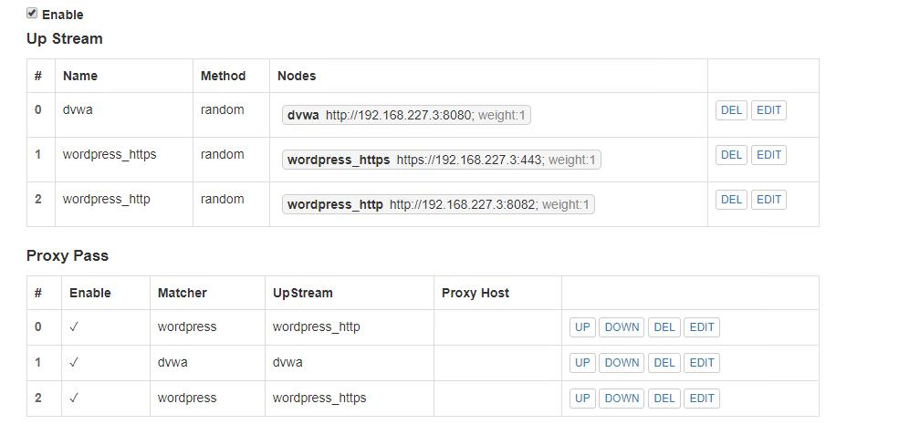
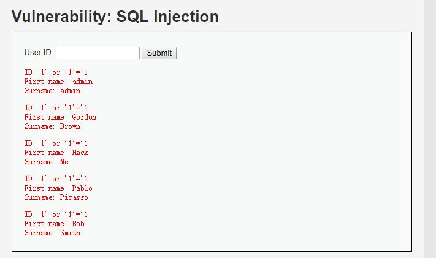
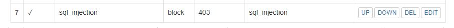

 # 第五章：WEB服务器实验

## 一、实验环境
- ubuntu 18.04 server
- nginx/1.10.3 (Ubuntu)
- WordPress 4.7【8082 port 443 port】
- DVWA【8080 port 】
- 本机ip：192.168.227.3


## 二、实验准备
### 1. 基本配置：
#### Nginx 
- 直接安装，默认监听80端口，稍后修改配置文件

```bash
# 安装nginx
sudo apt-get update
sudo apt install nginx
# 扩展
# install mysql
sudo apt-get install mysql-server
# install php
# install php进程管理器，php-mysql
sudo apt-get install php-fpm
sudo apt-get install php-mysql
sudo apt-get install php-gd
sudo apt install php-curl php-gd php-intl php-mbstring php-soap php-xml php-xmlrpc php-zip

 # 启动nginx 
 sudo systemctl start nginx
 ```

- 配置nginx使用php

```bash
# 修改nginx配置PHP-FPM进程的反向代理配置在nginx服务器上 保存退出
sudo vim /etc/nginx/sites-enabled/default

     location ~ \.php$ {
         include snippets/fastcgi-php.conf;
          fastcgi_pass unix:/var/run/php/php7.2-fpm.sock;
     }
     
 # 重新启动nginx使配置生效
 sudo systemctl restart nginx
 ```

#### VeryNginx
- 安装 VeryNginx&OpenResty

```bash
# 按提示安装git
git clone https://github.com/alexazhou/VeryNginx.git
cd VeryNginx
# 可能需要提权
# 不需要Python组件支持(脚本为简单的复制和授权)
python install.py install verynginx
```

- 安装依赖项
```bash
# 安装后再次执行python install.py install verynginx
sudo apt-get install libpcre3-dev
sudo apt-get install libssl-dev
sudo apt-get install build-essential

# 出现有关于安装zlib的报错则执行
sudo apt install zlib
sudo apt install zlib1g
sudo apt install zlib1g-dev
# 只有出现‘ *** All work finished successfully, enjoy it~ ’才安装成功
```

- 按教程配置文件开启ssl，并且生成ssl key和证书文件

```bash
# 签发证书
sudo openssl req -x509 -nodes -days 365 -newkey rsa:2048 -keyout /etc/ssl/private/nginx-selfsigned.key -out /etc/ssl/certs/nginx-selfsigned.crt
# 按提示输入信息

# 配置证书
# 创建配置文件
sudo vi /etc/nginx/snippets/self-signed.conf
# 写入以下内容
ssl_certificate /etc/ssl/certs/nginx-selfsigned.crt;
ssl_certificate_key /etc/ssl/private/nginx-selfsigned.key;
# 保存退出

# 修改Nginx配置
sudo vi /etc/nginx/sites-available/default
# 测试
sudo nginx -t
# 测试无误后重启Nginx
sudo systemctl restart nginx
```

- 配置VeryNginx，在/opt/verynginx/openresty/nginx/conf/nginx.conf 中将user值改为www-data，server监听端口改为8080

```bash
sudo vim /opt/verynginx/openresty/nginx/conf/nginx.conf
# 将user从nginx修改为www-data
# 修改server监听端口为8080
```

- 配置完成后，运行Nginx
```bash
# 创建用户
sudo adduser verynginx

# 不能直接启动nginx
sudo /opt/verynginx/openresty/nginx/sbin/nginx
```

- 安装完成


#### Wordpress
- 下载并安装
```bash
# 下载安装包
sudo wget https://wordpress.org/wordpress-4.7.zip

# 解压安装包
unzip wordpress-4.7.zip

# 将解压后的wordpress移到指定路径
sudo mkdir /var/www/html/wp.sec.cuc.edu.cn
sudo cp wordpress /var/www/html/wp.sec.cuc.edu.cn
```

- 在Mysql中新建一个数据库用于支撑Wordpress
```bash
# 前面已安装mysql
# 新建一个数据库wordpress
CREATE DATABASE wordpress DEFAULT CHARACTER SET utf8 COLLATE utf8_unicode_ci;

# 新建一个用户 刷新并退出
GRANT ALL ON wordpress.* TO 'wordpressuser'@'localhost' IDENTIFIED BY 'password';
FLUSH PRIVILEGES;
EXIT;

# 修改nginx配置 
sudo vim /etc/nginx/sites-enabled/default

# 将网站根站点修改为wordpress的安装目录 并保存退出
root /var/www/html/wp.sec.cuc.edu.cn;

# 从WordPress密钥生成器中获取安全值
curl -s https://api.wordpress.org/secret-key/1.1/salt/
```

- 将生成的内容复制到/var/www/html/wp-config.php中，并修改数据库的设置

#### DVWA
- 直接下载配置

```bash
# 下载DVWA
sudo git clone https://github.com/ethicalhack3r/DVWA /tmp/DVWA
# 移动到指定文件夹中
sudo mv /tmp/DVWA /var/www/html
# /config/config.inc.php.dist 去掉.dist
sudo cp /var/www/html/DVWA/config/config.inc.php.dist /var/www/html/DVWA/config/config.inc.php
```

- 在mysql为DVWA新建一个用户名, 修改DVWA中的配置,用于连接mysql数据库

```bash
# 登录MySQL
sudo mysql -u root -p

# 新建一个数据库dvwa
 CREATE DATABASE dvwa DEFAULT CHARACTER SET utf8 COLLATE utf8_unicode_ci;

# 新建一个用户dvwauser，分配管理dvwa的权限，设置密码 刷新并退出
 GRANT ALL ON dvwa.* TO 'dvwauser'@'localhost' IDENTIFIED BY 'p@ssw0rd';
 FLUSH PRIVILEGES;
 EXIT;
# 重启mysql生效
sudo systemctl restart mysql
 
# 打开DVWA的配置文件
 sudo vim /var/www/html/DVWA/config/config.inc.php
 
# 修改配置文件为自己需要的内容 保存退出
 $_DVWA[ 'db_server' ]   = '127.0.0.1';
 $_DVWA[ 'db_database' ] = 'dvwa';
 $_DVWA[ 'db_user' ]     = 'dvwauser';
 $_DVWA[ 'db_password' ] = 'p@ssw0rd';

# 修改php配置
sudo vi /etc/php/7.2/fpm/php.ini    
# allow_url_include = Off -> On

# 设置文件夹权限 
sudo chown -R www-data.www-data /var/www/html/DVWA

# 重启php
sudo systemctl restart php7.2-fpm

# 配置Nginx，开启8090端口监听
sudo vi /etc/nginx/sites-available/default

# 重启Nginx
sudo systemctl restart nginx
# /etc/nginx/sites-available/default详见配置文件
```

- 最终配置/etc/nginx/sites-available/default
- 安装完成，登录用户名密码分别为：admin和password，进入主界面

## 三、实验过程
- VeryNginx作为本次实验的Web App的反向代理服务器和WAF
- PHP-FPM进程的反向代理配置在nginx服务器上，VeryNginx服务器不直接配置Web站点服务



- 结果


#### 安全加固要求
- 使用IP地址方式均无法访问上述任意站点，并向访客展示自定义的友好错误提示信息页面-1
    - 相关配置：
    
    
    
    - 配置后
    

- Damn Vulnerable Web Application (DVWA)只允许白名单上的访客来源IP，其他来源的IP访问均向访客展示自定义的友好错误提示信息页面-2
    - 相关配置（假设白名单中ip为192.168.67.2）：
    
    
    
    - 配置后不允许本机IP访问指定站点：
    

- 在不升级Wordpress版本的情况下，通过定制VeryNginx的访问控制策略规则，热修复WordPress < 4.7.1 - Username Enumeration
    - 相关配置：
    
    
    
    - 配置后：
    

- 通过配置VeryNginx的Filter规则实现对Damn Vulnerable Web Application (DVWA)的SQL注入实验在低安全等级条件下进行防护
    - filter前：
    
    - 相关配置
    
    
    
    - 配置后：
    

#### VERYNGINX配置要求
- VeryNginx的Web管理页面仅允许白名单上的访客来源IP，其他来源的IP访问均向访客展示自定义的友好错误提示信息页面-3
    - 配置：
    
    
    
    - 配置后：
    
- 通过定制VeryNginx的访问控制策略规则实现：
    - 限制DVWA站点的单IP访问速率为每秒请求数 < 50
    
    - 超过访问频率限制的请求直接返回自定义错误提示信息页面-4
        - curl查看页面返回数据：
        
    - 禁止curl访问
        - 配置：
        
        

## 参考：
- [https://github.com/CUCCS/linux-2019-jckling/blob/0x05/0x05/%E5%AE%9E%E9%AA%8C%E6%8A%A5%E5%91%8A.md](https://github.com/CUCCS/linux-2019-jckling/blob/0x05/0x05/%E5%AE%9E%E9%AA%8C%E6%8A%A5%E5%91%8A.md)
- [https://blog.csdn.net/u010953692/article/details/88761006](https://blog.csdn.net/u010953692/article/details/88761006)
- [https://github.com/CUCCS/linux-2019-LeLeF/tree/chap0x05](https://github.com/CUCCS/linux-2019-LeLeF/tree/chap0x05)
- [https://www.digitalocean.com/community/tutorials/how-to-create-an-ssl-certificate-on-nginx-for-ubuntu-14-04](https://www.digitalocean.com/community/tutorials/how-to-create-an-ssl-certificate-on-nginx-for-ubuntu-14-04)
- [https://github.com/alexazhou/VeryNginx/blob/master/readme_zh.md](https://github.com/alexazhou/VeryNginx/blob/master/readme_zh.md)
- [https://github.com/alexazhou/VeryNginx/wiki/Trouble-Shooting](https://github.com/alexazhou/VeryNginx/wiki/Trouble-Shooting)